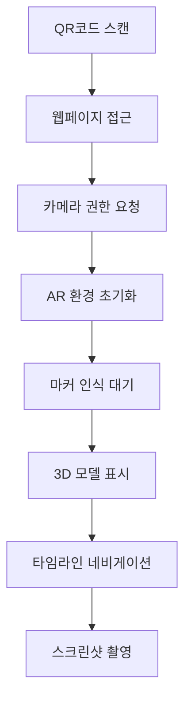

# 온누리교회 40주년 AR 프로젝트 설계 문서

## 📋 프로젝트 개요

**목적**: 온누리교회 40년 건물 변천사를 WebAR로 시각화  
**타겟**: 성도들의 모바일 디바이스 (Android/iOS)  
**기술**: AR.js 기반 이미지 마커 WebAR  

## 🏗️ 시스템 아키텍처

### 기술 스택
```
Frontend: HTML5 + CSS3 + JavaScript
AR Engine: AR.js + A-Frame
3D Format: GLTF/GLB
Hosting: 정적 웹사이트 (GitHub Pages/Netlify)
```

### 컴포넌트 구조
```
sns-ar-project/
├── index.html          # 메인 AR 페이지
├── assets/
│   ├── markers/        # 이미지 마커 파일들
│   ├── models/         # 3D 건물 모델 (GLB)
│   ├── images/         # 역사적 사진들
│   └── audio/          # 설명 음성 (선택)
├── js/
│   ├── ar-controller.js # AR 로직 관리
│   ├── timeline.js     # 시대별 전환
│   └── camera.js       # 스크린샷 기능
├── css/
│   └── styles.css      # UI 스타일링
└── data/
    └── timeline.json   # 변천사 메타데이터
```

## 🎯 핵심 기능 설계

### 1. AR 마커 인식 시스템
- **이미지 마커**: 교회 로고, 기념품, 포스터
- **인식 방식**: AR.js NFT (Natural Feature Tracking)
- **성능 고려**: 저해상도 마커 지원

### 2. 시대별 콘텐츠 시스템
```javascript
// timeline.json 구조 예시
{
  "periods": [
    {
      "year": "1984",
      "title": "교회 설립",
      "model": "models/church-1984.glb",
      "description": "온누리교회의 시작...",
      "image": "images/1984-founding.jpg"
    },
    {
      "year": "1995",
      "title": "새 성전 건축",
      "model": "models/church-1995.glb",
      "description": "새로운 성전으로...",
      "image": "images/1995-new-building.jpg"
    }
  ]
}
```

### 3. 사용자 인터페이스
- **네비게이션**: 시대별 이동 버튼
- **정보 패널**: 연도, 제목, 설명 오버레이
- **카메라 버튼**: AR 장면 스크린샷

## 🔧 개발자 친화적 설계

### JavaScript 최소화 전략
```html
<!-- A-Frame 선언적 구조 활용 -->
<a-scene embedded arjs>
  <a-marker preset="custom" type="pattern" url="assets/markers/church-marker.patt">
    <a-entity id="church-model" 
              gltf-model="assets/models/church-current.glb"
              scale="0.1 0.1 0.1"
              position="0 0 0">
    </a-entity>
  </a-marker>
  <a-entity camera></a-entity>
</a-scene>
```

### 모듈화된 JavaScript 구조
```javascript
// ar-controller.js - 핵심 AR 로직만
class ARController {
  constructor() {
    this.currentPeriod = 0;
    this.timeline = null;
  }
  
  loadTimeline() { /* 단순한 fetch 로직 */ }
  switchPeriod(index) { /* 모델 교체 로직 */ }
  takeScreenshot() { /* 캔버스 캡처 */ }
}
```

## 📱 모바일 최적화 전략

### 성능 고려사항
1. **3D 모델 최적화**
   - 폴리곤 수 제한 (< 5,000 faces)
   - 텍스처 크기 최적화 (512x512px)
   - GLTF Draco 압축 사용

2. **로딩 최적화**
   - 프리로딩 시스템
   - 점진적 로딩 (LOD)
   - 캐싱 전략

3. **기기별 대응**
   - iOS Safari: WebXR 폴리필
   - Android Chrome: 네이티브 WebXR
   - 저사양 기기: 품질 다운그레이드

## 🎮 사용자 경험 플로우



## 🚀 개발 로드맵

### Phase 1: MVP (2주)
- [x] 기본 AR 마커 인식
- [x] 단일 3D 모델 표시
- [x] 기본 UI 구성

### Phase 2: 콘텐츠 (3주)
- [ ] 시대별 모델 3-5개
- [ ] 타임라인 네비게이션
- [ ] 정보 패널 구현

### Phase 3: 고도화 (2주)
- [ ] 스크린샷 기능
- [ ] 성능 최적화
- [ ] 다양한 기기 테스트

### Phase 4: 배포 (1주)
- [ ] 최종 테스트
- [ ] 호스팅 설정
- [ ] QR코드 생성

## ⚠️ 기술적 위험도

| 항목 | 위험도 | 대응 방안 |
|------|--------|-----------|
| AR.js 브라우저 호환성 | 중 | 폴리필 사용, 대체 브라우저 안내 |
| 3D 모델 성능 | 높 | 모델 최적화, LOD 시스템 |
| JavaScript 학습 곡선 | 중 | 단계적 학습, 커뮤니티 활용 |
| 마커 인식률 | 중 | 마커 디자인 최적화, 다중 마커 |

## 📚 개발 참고 자료

### 학습 우선순위
1. **AR.js 공식 문서**: https://ar-js-org.github.io/AR.js-Docs/
2. **A-Frame 가이드**: https://aframe.io/docs/
3. **GLTF 최적화**: https://gltf-transform.donmccurdy.com/

### Unity 경험 활용 포인트
- 3D 좌표계 이해 → WebGL 좌표계
- 머티리얼/텍스처 → GLTF PBR
- 애니메이션 → A-Frame 애니메이션

이 설계를 바탕으로 단계별 개발을 진행하면 JavaScript 초보자도 성공적으로 WebAR 프로젝트를 완성할 수 있습니다.